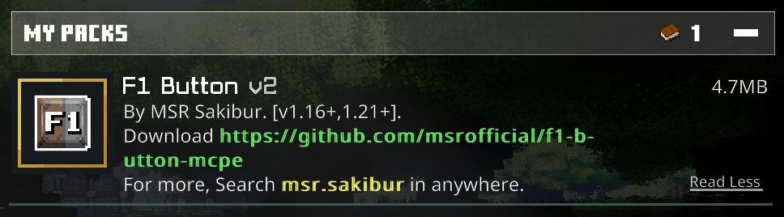
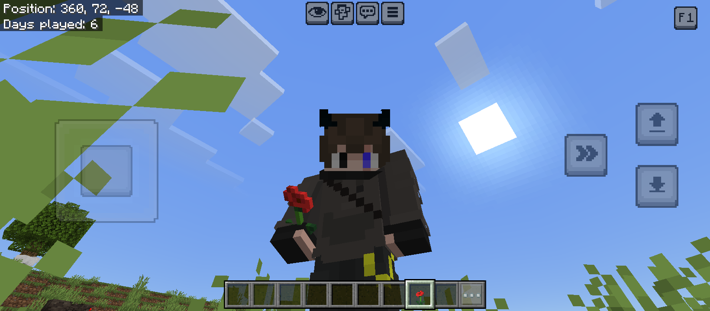
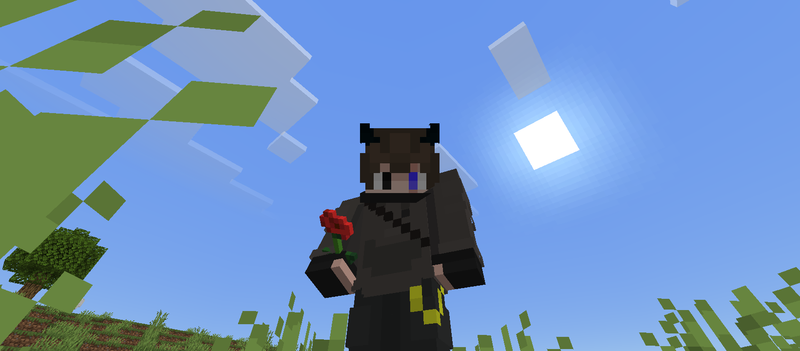

  

  # F1 Button v2 for MCPE
  
  **The ultimate HUD hider and Cinematic tool for Minecraft Bedrock/Pocket Edition.**

   

  
<b>If you find this pack useful, please give this repository a Star!</b>

  
  [Report Bug or Request Feature](https://github.com/msrofficial/f1-button-mcpe/issues)

---

## Introduction
Welcome to the **F1 Button v2** repository!
This resource pack brings the Java Edition "F1" functionality to mobile.
It allows you to completely hide your **HUD (Heads-Up Display)**, **Touch Controls**, **Hotbar**, and **Hand** with a single click.
Perfect for content creators, photographers, and players who want a clean, immersive experience.

## Features
* **Perfect Placement:** The F1 button is located at the **Top-Right Corner** of the screen, making it super easy to reach with your thumb while playing.
* **Hide HUD:** Removes Buttons, hearts, hunger bar, and XP bar.
* **Invisible Controls:** Hides the D-pad, jump button, and inventory buttons.
* **Lag Free:** Extremely lightweight.
* **Version Support:** Works smoothly on **v1.16 to v1.21+**.

---

## Screenshots & Preview

### Menu View

### Comparison (Before vs After)

| Before (HUD Visible) | After (F1 Enabled) |
| :---: | :---: |
|  |  |
| *Cluttered Screen* | *Clean Cinematic Look* |

---

## How to Download & Install

You can download the pack from the **[Releases Section](https://github.com/msrofficial/f1-button-mcpe/releases)**.
We provide two formats:

### Option 1: .mcpack (Recommended)
*Best for mobile (Android/iOS) and Windows 10/11 users.*

1.  Download the **`F1.Button.V2.by.MSR.Sakibur.mcpack`** file from Releases.
2.  Open the file directly. Minecraft will open and say "Import Started".
3.  Go to **Settings > Global Resources > My Packs** and activate it.

### Option 2: .zip (Manual)
*Use this if the .mcpack version doesn't work for you.*

1.  Download the **`F1.Button.V2.by.MSR.Sakibur.zip`** file.
2.  Extract the zip file.
3.  Move the extracted folder to: 
    * `games/com.mojang/resource_packs` (For older Android versions)
    * `Android/data/com.mojang.minecraftpe/files/games/com.mojang/resource_packs` (For Android 11+)
4.  Open Minecraft and activate the pack.

---

## Compatibility
This pack is designed for **Minecraft Bedrock Edition (MCPE)** and supports:
* Android & iOS
* Windows 10/11 Edition
* Console (If imported via Realms/Servers)

## Credits
**Created by MSR Sakibur**
* If you use this pack in a video, please provide a link to this repository.
* Do not re-upload to other sites without permission.

---

## Contact
If you have any questions or suggestions, feel free to reach out:

* **Facebook:** [sakibur.msr](https://www.facebook.com/sakibur.msr)
* **Telegram:** [msr0official](https://t.me/msr0official)
* **Instagram:** [msr.sakibur](https://www.instagram.com/msr.sakibur)
